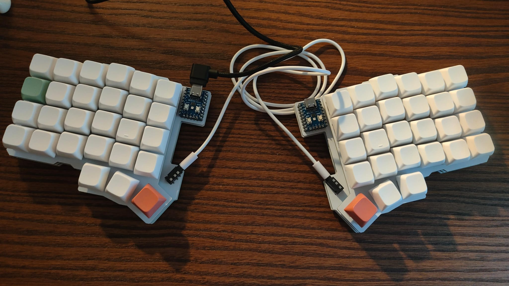
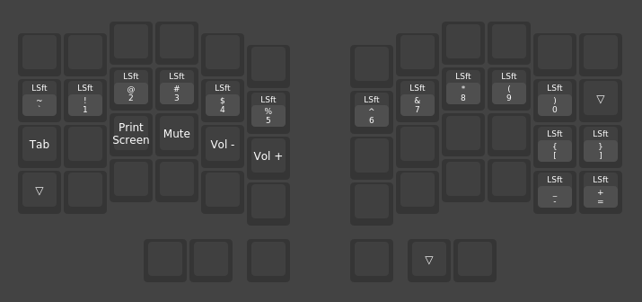

# keyboard-layouts

In this repo you can find the keyboards I use with their layouts.

## Silakka 54
[Silakka 54](https://squalius-cephalus.github.io/silakka54/) is a DIY ergonomic mechanical keyboard.

### 42 keys layout
For this keyboard I'm currently trying a layout that does not use the top row and has 4 layers where I use frequently 3 of them. It's configured with VIAL, the layout file is [silakka54-42.vil](silakka54-42.vil) and you can find the screenshots of the different layers below.

**Layer 0:** Base layer.

**Layer 1:** Numbers, arrow keys and some symbols.

**Layer 2:** Symbols and media keys.

**Layer 3:** Fn keys.

